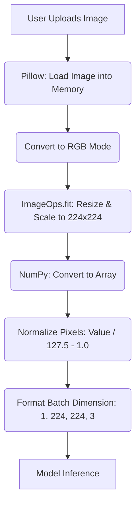

# Image Processing Flow & Example

In the AGRIAI project, before an uploaded image can be evaluated by the predictive model, it must pass through a strict preparation pipeline. Here is the visual flow and a practical example of what happens to the data at each stage.

## Process Flowchart


---

## Step-by-Step Example

Let's imagine a user uploads a photo of a tomato leaf called `affected_leaf.png`. The original dimensions of this picture are **1024x768 pixels**, and it has a transparent background (meaning it has an Alpha channel resulting in RGBA color mode). Here is how the codebase systematically prepares it:

### Step 1: Loading and Formatting to RGB
```python
image = Image.open(instance.image.path).convert("RGB")
```
- **What happens:** The application loads the `1024x768` image. 
- **Example Data:** Because the model cannot understand transparent/invisible pixels, the `.convert("RGB")` command forces the image to drop the alpha channel. Now it only retains the core Red, Green, and Blue sub-pixel colors.

### Step 2: Intelligent Resizing (LANCZOS)
```python
size = (224, 224)
image = ImageOps.fit(image, size, Image.Resampling.LANCZOS)
```
- **What happens:** The MobileNetV2 model *only* accepts images that are exactly 224x224 pixels. 
- **Example Data:** Using the high-quality **LANCZOS** algorithm, the system crops any overlapping wide dimensions slightly without stretching or distorting the physical symptoms of the leaf, scaling the image precisely down to exactly **`224x224`**.

### Step 3: Array Casting
```python
image_array = np.asarray(image)
```
- **What happens:** Machine learning models don't look at "pictures"; they interact with mathematical matrices.
- **Example Data:** The image is converted into a structured `numpy` array grid. Each single pixel is represented by three numbers (0 to 255) for Red, Green, and Blue. For instance, a bright green spot on the leaf might convert to values like `[34, 180, 50]`. 
- **Current Shape:** The matrix size is exactly `(224, 224, 3)`.

### Step 4: Strict Numerical Normalization
```python
normalized_image_array = (image_array.astype(np.float32) / 127.5) - 1
```
- **What happens:** The base TensorFlow model was pre-trained expecting pixel inputs scaled between **-1.0 and 1.0** (instead of 0 to 255). We must apply that same transformation.
- **Example Data:** 
  - A black pixel value of `0` is mathematically transformed to: `(0 / 127.5) - 1` = **`-1.0`**
  - A white pixel value of `255` becomes: `(255 / 127.5) - 1` = **`1.0`**
  - Our bright green spot `[34, 180, 50]` becomes `[-0.73, 0.41, -0.60]`.

### Step 5: Simulating a Batch
```python
data = np.ndarray(shape=(1, 224, 224, 3), dtype=np.float32)
data[0] = normalized_image_array
```
- **What happens:** Neural networks expect images in bundles (batches) rather than single, isolated matrices. 
- **Example Data:** Even though the user just uploaded one picture, the application wraps the array in an outer list. The final tensor shape handed to the model is `[1, 224, 224, 3]`, conceptually telling the system contextually: "Here is a batch comprising **1** image, sized **224x224**, with **3** color channels."

### Step 6: Inference Start
```python
prediction_probs = model.predict(data)
```
- The normalized batch is definitively fed to the loaded CNN. The network layers interpret those decimals (`-1.0 to 1.0`), mapping visual patterns until finally outputting 10 probability scores (ranging from 0-1) associated with the respective diseases.
